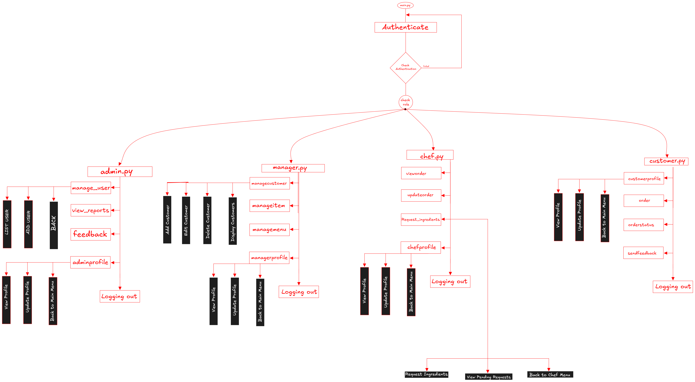

## Overview
This project is a **Food Ordering System** that allows different user roles (Admin, Chef, Manager, Customer) to log in and access specific functionalities based on their role. The system includes an authentication process with a password recovery feature. After login, users are redirected to their respective dashboards (`admin`, `chef`, `manager`, `customer`) for handling relevant tasks. The project is structured using Python modules to keep the user roles and actions organized. The main file manages login, authentication, and user navigation.

## Project Structure
The filesystem is organized into modular directories and files to support a role-based application. Below is the layout of the project:




```
Delicious Restaurant Management System/
│
├── documentation/
├── user_admin/
│   ├── __init__.py
│   ├── admin.py
│   ├── adminprofile.py
│   ├── feedback.py
│   ├── manage_user.py
│   └── view_reports.py
│   
├── user_chef/
│   ├── __init__.py
│   ├── chef.py
│   ├── chefprofile.py
│   ├── request.py
│   ├── updateorder.py
│   └── vieworder.py
│   
├── user_customer/
│   ├── __init__.py
│   ├── customer.py
│   ├── customerprofile.py
│   ├── order.py
│   ├── orderstatus.py
│   └── sendfeedback.py
│   
├── User_Data/
│   ├── customer_credentials.json
│   ├── feedbacks.json
│   ├── inventory.json
│   ├── menu.json
│   ├── orders.json
│   └── users.json
│   
├── user_manager/
│   ├── __init__.py
│   ├── managecustomer.py
│   ├── manageitem.py
│   ├── managemenu.py
│   ├── manager.py
│   └── managerprofile.py
│   
├── main.py
│   
└── README.md
```

### Description of Key Files and Folders
- **`main.py`**: The entry point of the application, handling user login and redirecting to role-specific menus.
- **`user_admin/`**: Contains modules for administrative tasks (e.g., `manage_user.py`, `view_reports.py`).
- **`user_chef/`**: Manages chef-related functionalities (e.g., `vieworder.py`, `updateorder.py`).
- **`user_customer/`**: Handles customer features (e.g., `order.py`, `sendfeedback.py`).
- **`user_manager/`**: Includes manager-specific modules (e.g., `managecustomer.py`, `managemenu.py`).
- **`documentation/`**: Stores the assignment PDF and other documentation files.
- **`__init__.py`**: Marks each directory as a Python package.
- **`__pycache__/`**: Contains compiled Python bytecode files.
- **`admin_profile.json`**: Stores admin profile data (to be expanded with text files per requirements).


### System Overview
The system supports four user roles with the following functionalities:

1. **Administrator**
   - Manage staff (Add, Edit, Delete).
   - View sales reports (by month, chef, etc.).
   - View customer feedback.
   - Update own profile.
2. **Manager**
   - Manage customers (Add, Edit, Delete).
   - Manage menu categories and pricing (Add, Edit, Delete).
   - View ingredients list requested by chefs.
   - Update own profile.
3. **Chef**
   - View customer orders.
   - Update order status (In Progress, Completed).
   - Request ingredients (Add, Edit, Delete).
   - Update own profile.
4. **Customer**
   - View and order food (Add, Edit, Delete) and pay to confirm.
   - View order status.
   - Send feedback to the administrator.
   - Update own profile.


## How to Run the Project
1. Ensure Python 3.13 (or compatible version) is installed.
2. Navigate to the project directory (`Delicious_Restaurant_Management_System`).
3. Run the main script:
   ```bash
   python main.py
   ```
4. Log in with the following default credentials:
   - Admin: `admin` / `admin123`
   - Chef: `chef` / `chef123`
   - Manager: `manager` / `manager123`
   - Customer: as the registered .
5. Follow the menu prompts to navigate the system.

## Assumptions
- User data (usernames and passwords) is initially hardcoded in `main.py` but will be migrated to text files.
- Each user role has a separate profile managed via text files.
- Sales reports and feedback are stored in text files and updated dynamically.
- Validation ensures only three login attempts are allowed.


## Future Improvements
- Implement text file storage for all data (users, orders, feedback, etc.).
- Add validation for input data (e.g., username uniqueness, password strength).
- Include error handling for file operations.
- Develop additional features like order history or ingredient stock management.


## References

Lutz, M. (2013). *Learning Python* (5th ed.). O'Reilly Media.  
OpenAI. (2024). *ChatGPT*. OpenAI. https://chatgpt.com/  
Python Software Foundation. (2024). *Python 3.13 documentation*. Python.org. https://docs.python.org/3/  
Stack Exchange Inc. (2024). *Stack Overflow: Python programming Q&A*. Stack Exchange. https://stackexchange.com/
xAI. (2024). *Grok AI documentation*. xAI. https://grok.xai/  
---